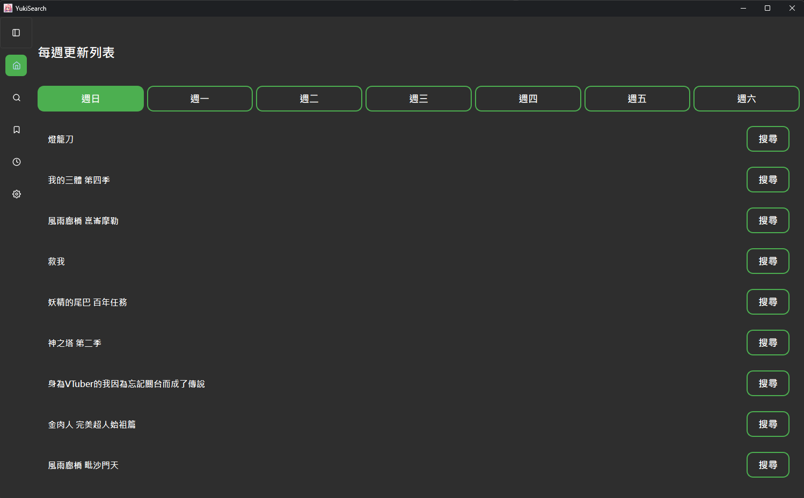
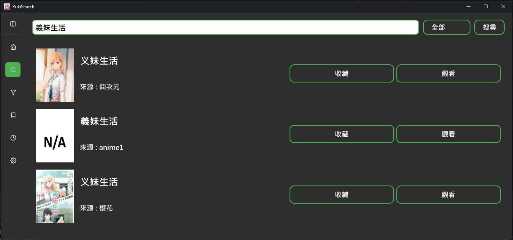
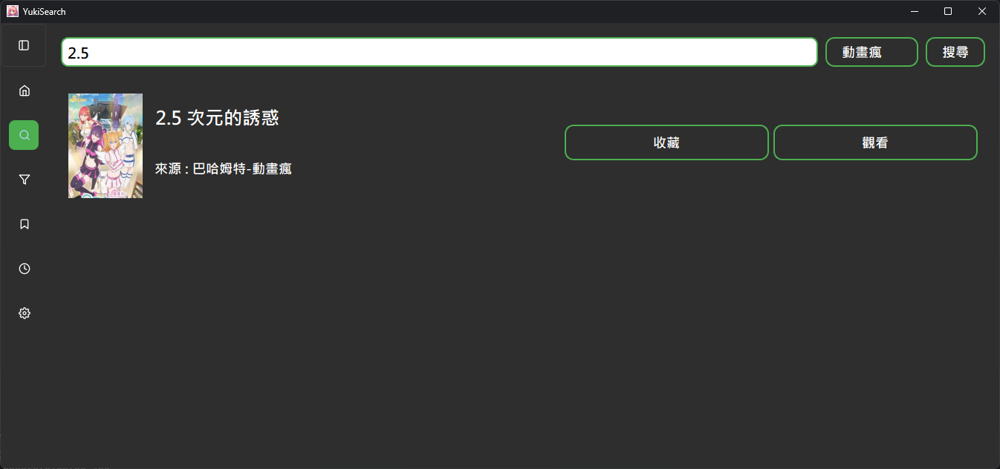
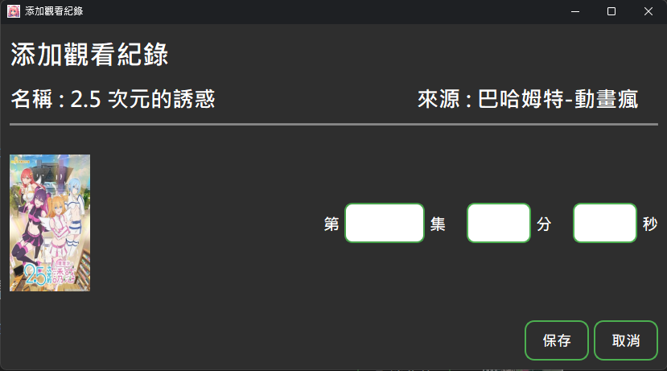
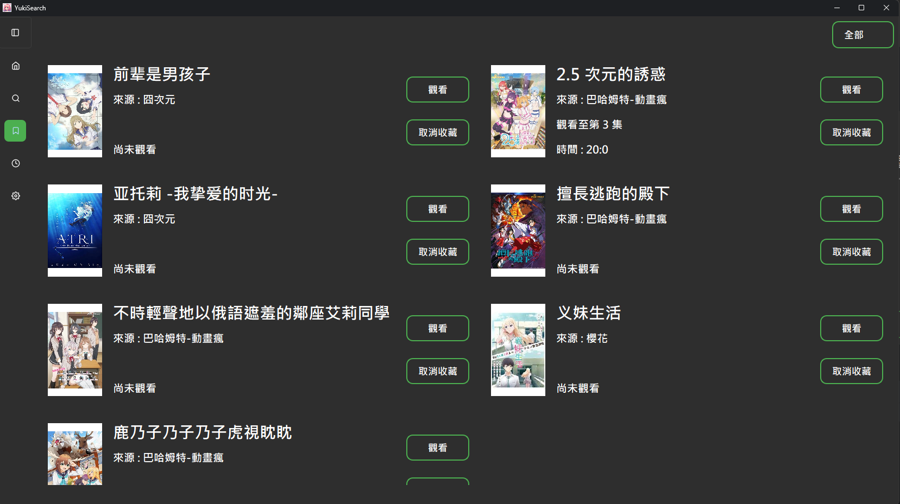
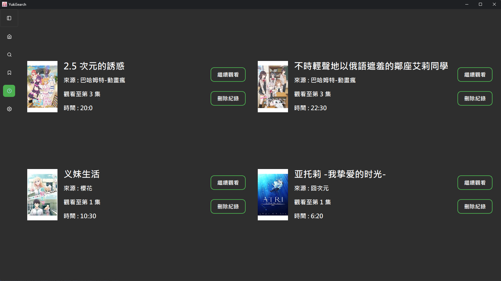

# YukiSearch

---

## 簡介

### 整合多網站 動畫搜尋與管理

---

## 功能

- **一鍵查詢**：支持動畫瘋、囧次元、Anime1、櫻花等網站
- **一鍵導向網站**：不耗本地空間
- **統一管理**：不同網站的動漫 一起收藏
- **標籤管理**：為喜歡的動畫添加自定義標籤
- **觀看進度紀錄**：看到哪裡? 軟體幫你記

---

## 每週新番全部列出來

## 一次幫你查多個網站

## 喜歡特定網站? 也能夠定向查詢

## 點擊觀看後 自動跳出紀錄選單

## 不同網站 統一管理收藏

## 看到哪裡 幫你記

---

## 聲明

本軟體僅供學術研究使用，影音內容僅導向相關網站，請支持正版內容。

---

## 搜尋資料來源

- [巴哈姆特動畫瘋](https://ani.gamer.com.tw/)
- [囧次元](https://9ciyuan.com/)
- [Anime1](https://anime1.me/)
- [櫻花動漫](https://yhdm.one/)
- [Bangumi番組計劃](https://bangumi.tv/)